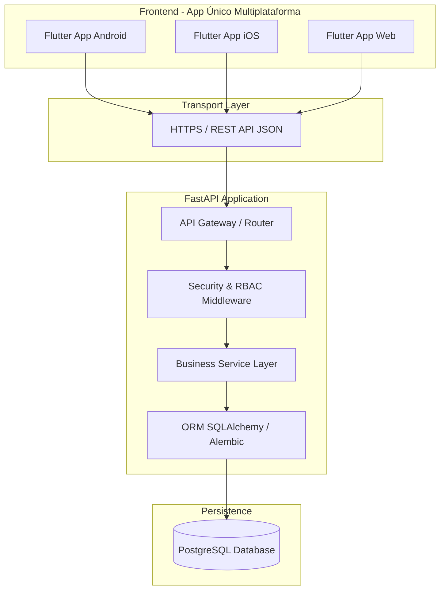

# 02 - Arquitetura do Sistema

## 1. Visão Geral da Arquitetura

O sistema é construído segundo o padrão de arquitetura em camadas desacopladas (Client-Server), onde o cliente móvel/web consome serviços do backend por meio de uma API REST padronizada.



---

## 2. Tecnologias Adotadas

| Camada | Tecnologia | Papel & Justificativa |
| :--- | :--- | :--- |
| **Frontend** | Flutter (Dart 3.x) | Aplicação única multiplataforma (Android, iOS e Web), reduzindo custo de desenvolvimento e garantindo consistência visual. |
| **Comunicação** | REST API (JSON sobre HTTPS) | Protocolo padrão de mercado, fácil integração, suporte a idempotência e compatível com clientes mobile/web. |
| **Backend** | FastAPI (Python 3.11+) | Framework assíncrono de altíssima performance, validação nativa com Pydantic v2 e documentação Swagger gerada automaticamente. |
| **Banco de Dados** | PostgreSQL 15+ | Banco relacional robusto, suporte transacional rigoroso (ACID), suporte a dados semiestruturados via JSONB e auditoria confiável. |
| **Hospedagem** | Render (PaaS) | Utilizado primariamente para fase de MVP/testes devido à simplicidade de deploy, mantendo a aplicação 100% conteinerizada (Docker) e agnóstica a provedor. |

---

## 3. Arquitetura do Frontend (Flutter)

A aplicação Flutter utiliza uma estrutura orientada a recursos (*feature-first*) com separação clara de responsabilidades:

- **Presentation Layer (UI):** Widgets reativos adaptados por perfil (Cliente, Prestador, Admin) e tamanho de tela (mobile vs. web).
- **State Management Layer:** Gerenciamento de estado previsível (BLoC / Riverpod / Provider) desacoplado dos componentes visuais.
- **Domain & Service Layer:** Regras locais de apresentação, formatação de dados e validações prévias de formulário.
- **Data & Repository Layer:** Abstração de fontes de dados. Gerencia chamadas HTTP para o backend FastAPI e fallback para o banco de dados local.
- **Local Persistence Layer (Offline Storage):** Banco local (SQLite via Drift / Isar / Hive) e Fila de Sincronização (*Outbox Pattern*) para operação offline.

---

## 4. Arquitetura do Backend (FastAPI)

O backend FastAPI implementa a autoridade máxima das regras de negócio do sistema:

```
app/
├── api/
│   └── v1/
│       ├── endpoints/        # Rotas REST organizadas por domínio
│       └── middlewares/      # JWT, Rate Limiting, Audit Log, CORS
├── core/
│   ├── config.py             # Variáveis de ambiente e configurações
│   └── security.py           # Hashing de senhas e geração de tokens JWT
├── db/
│   ├── base.py               # Configuração do SQLAlchemy ORM
│   └── migrations/           # Controle de versão do schema via Alembic
├── models/                   # Entidades declarativas do PostgreSQL
├── schemas/                  # DTOs de validação Pydantic (Input/Output)
├── services/                 # Regras de negócio puras e transações
└── main.py                   # Ponto de entrada da aplicação FastAPI
```

---

## 5. Estratégia de Hospedagem e Independência de Infraestrutura

1. **Conteinerização com Docker:** A aplicação FastAPI e as dependências são empacotadas em imagens Docker padronizadas.
2. **Ambiente Inicial (Render):**
   - Web Service para a API FastAPI.
   - Managed PostgreSQL Database para a persistência relacional.
3. **Agnosticismo de Provedor:** A arquitetura proíbe o uso de recursos proprietários específicos do Render (ex: Render Disks específicos ou SDKs proprietários). O backend pode ser migrado para AWS (ECS/RDS), GCP (Cloud Run/Cloud SQL), Azure ou infraestrutura *on-premises* sem alteração de código.

---

## 6. Decisões Pendentes de Arquitetura

- `DECISÃO PENDENTE`: Seleção formal do pacote de banco local do Flutter para persistência offline (Drift/SQLite vs. Isar vs. Hive).
- `DECISÃO PENDENTE`: Definição do serviço de armazenamento de objetos para fotos de pneus e comprovantes (AWS S3 vs. Cloudflare R2 vs. Supabase Storage no ambiente definitivo).
