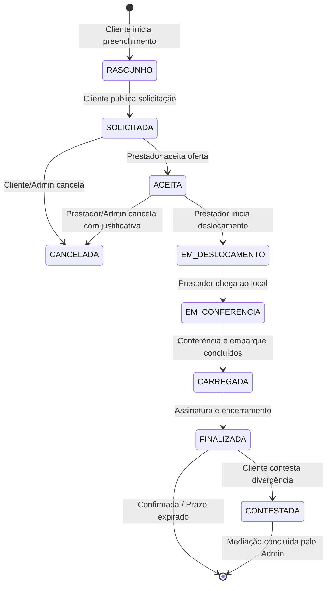

# 05 - Fluxo Operacional da Coleta

## 1. Máquina de Estados da Coleta

A coleta passa por um ciclo de vida estritamente controlado por uma máquina de estados no backend FastAPI. Nenhuma transição de estado pode ignorar a sequência lógica definida.

---

## 2. Passo a Passo do Fluxo Operacional

### Etapa 1: Abertura e Declaração da Carga (Cliente)
1. O Cliente seleciona o local de origem (ou utiliza o endereço cadastrado).
2. O Cliente informa a **Quantidade Declarada** de pneus e especifica as características (marca, dimensão, estado aproximado).
3. O Cliente publica a solicitação. O status transita para `SOLICITADA`.

### Etapa 2: Oferta e Aceite (Prestador)
1. O backend notifica os prestadores disponíveis na região.
2. O Prestador visualiza a solicitação, distância, quantidade declarada de pneus e valor estimado a receber.
3. O Prestador aceita a solicitação. O status transita para `ACEITA`.

### Etapa 3: Deslocamento e Chegada (Prestador)
1. O Prestador clica em "Iniciar Deslocamento". O status transita para `EM_DESLOCAMENTO`.
2. Ao chegar ao endereço, o Prestador confirma a chegada. O status transita para `EM_CONFERENCIA`.

### Etapa 4: Conferência Física no Local (Mobile-First / Offline-Capable)
1. **Carregamento Automático:** O aplicativo do prestador exibe os itens pré-declarados pelo cliente. **Não é necessário re-digitar a carga.**
2. **Contagem e Registro Triplo:**
   - O prestador valida a **Quantidade Conferida** física no local.
   - O prestador informa a **Quantidade Efetivamente Coletada**.
3. **Registro de Identificadores dos Pneus:**
   - Para os pneus coletados, o prestador registra:
     - **DOT** (obrigatório para análise de idade). Formato: `WWYY` (Semana/Ano).
     - **Número de Fogo** (opcional/se houver).
     - **Número de Série** (opcional/se houver).
   - O app calcula a idade aproximada. Se a idade for $\ge 7$ anos, a interface exibe um **alerta visual em destaque (indicador vermelho)**.
   - O sistema aceita a repetição do mesmo código DOT em múltiplos pneus.
4. **Registro de Divergências:**
   - Se a quantidade conferida/coletada for diferente da declarada, o app exige justificativa e foto comprovatória.

### Etapa 5: Encerramento e Validação
1. O Prestador colhe a assinatura digital do responsável no local (ou foto da carga embarcada).
2. O Prestador finaliza a coleta no app. O status transita para `FINALIZADA`.
3. Se o prestador estiver sem conexão de internet, os dados são salvos na fila local (*Outbox Pattern*) e sincronizados automaticamente ao restabelecer o sinal.

### Etapa 6: Pós-Coleta e Liquidação
1. O Cliente recebe notificação da finalização e visualiza as quantidades conferidas/coletadas e fotos.
2. O Cliente pode confirmar ou contestar a coleta.
3. O sistema calcula a remuneração do prestador (ex: 247 pneus $\times$ R\$ 2,50 = R\$ 617,50), gera a transação financeira imutável e atualiza a reputação do prestador.

---

## 3. Decisões Pendentes do Fluxo da Coleta

- `DECISÃO PENDENTE`: Definição se a assinatura digital do responsável no local de coleta é um campo obrigatório para finalização da coleta no MVP.
- `DECISÃO PENDENTE`: Definição de regras de tolerância percentual automática para divergências de quantidade antes de permitir encerramento sem intervenção administrativa.
