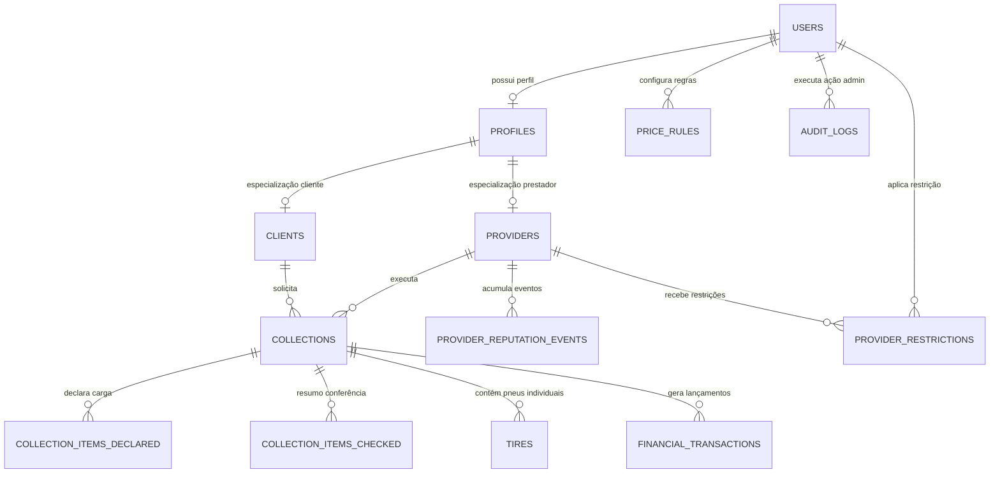

# 06 - Modelo de Dados Conceitual da Plataforma

## 1. Visão Geral e Princípios de Modelagem Conceitual

O modelo de dados da plataforma foi desenvolvido para garantir alta consistência transacional, rastreabilidade operacional individualizada, conformidade com a LGPD e suporte nativo à operação offline no campo.

### Princípios Fundamentais:
1. **Identificadores Únicos Universais (UUIDv4):** Todas as entidades utilizam `UUIDv4` como Chave Primária (PK). Isso permite a geração segura de identificadores individuais no dispositivo móvel Flutter durante operações offline antes da sincronização com o backend FastAPI.
2. **Backend como Autoridade de Dados:** Validações de integridade, cálculo exato da idade de pneus por semana/ano de DOT, validação de regras financeiras e checagem de permissões são executados exclusivamente no backend. O aplicativo Flutter apenas apresenta os resultados.
3. **Imutabilidade Histórica (Snapshots):** Transações financeiras, valores contratados e dados de entrega gravam *snapshots* imutáveis no encerramento da coleta para prevenir alterações retroativas.
4. **Proteção de Dados Sensíveis (LGPD):** Senhas são armazenadas exclusivamente como hashes salgados (*Argon2id* ou *bcrypt*). Dados pessoais e comerciais (CPF/CNPJ, chave Pix, geolocalização) possuem acesso restrito via RBAC.

---

## 2. Análise de Entidades: Mantidas vs. Descartadas/Incorporadas

A tabela abaixo resume a análise conceitual das entidades do sistema, detalhando a decisão de manutenção ou incorporação:

| Entidade Analisada | Status Conceitual | Decisão & Justificativa Arquitetural |
| :--- | :---: | :--- |
| **Usuário** (`users`) | **MANTIDA** | Entidade de autenticação base, credenciais, status da conta e *role* primária. |
| **Perfil** (`profiles`) | **MANTIDA** | Entidade contendo dados pessoais/comerciais (Nome/Razão Social, CPF/CNPJ, Telefone, Chave Pix). |
| **Cliente** (`clients`) | **MANTIDA** | Extensão do perfil para usuários geradores de demanda de coleta. |
| **Prestador** (`providers`) | **MANTIDA** | Extensão do perfil para coletores/transportadores, contendo score de reputação, taxa de resposta e veículos. |
| **Administrador** | **INCORPORADA** | Representada como valor da *role* (`ADMINISTRADOR`) em `users`. É a entidade responsável pela configuração de regras via Dashboard Administrativa. |
| **Coleta** (`collections`) | **MANTIDA** | Entidade transacional central que gerencia a máquina de estados e vincula cliente, prestador e valores. |
| **Item Declarado** (`collection_items_declared`) | **MANTIDA** | Declaração prévia da quantidade total estimada e características informadas pelo cliente no agendamento. |
| **Item Conferido** (`collection_items_checked`) | **MANTIDA** | Resumo da conferência da carga (quantidade conferida, coletada, fotos e justificativas de divergência). |
| **Pneu** (`tires`) | **MANTIDA (REGRO OFICIAL)** | **Cada pneu coletado possui um registro individual com UUID próprio.** Uma coleta de 250 pneus gera 250 registros individuais em `tires`. |
| **Endereço / Local de Coleta** | **INCORPORADO** | Incorporado como Value Object JSONB imutável em `collections.endereco_origem_json` para garantir a imutabilidade do local da coleta. |
| **Status da Coleta** | **INCORPORADO** | Campo enumerado (`status`) na entidade `collections`, controlado pela máquina de estados do FastAPI. |
| **Divergência e Evidências/Fotos** | **INCORPORADAS** | Incorporadas como atributos em `collection_items_checked` e `tires`. |
| **Regras de Preço** (`price_rules`) | **MANTIDA** | Tabela paramétrica de regras de preços independentes para Clientes e Prestadores, configuradas pelo Administrador via Dashboard. |
| **Pagamento / Transações** (`financial_transactions`) | **MANTIDA** | Lançamentos financeiros desacoplados (cliente vs. prestador) com valores fixados por *snapshot* no encerramento da coleta. |
| **Eventos de Reputação** (`provider_reputation_events`) | **MANTIDA** | Registro de eventos operacionais para composição auditável do score do prestador. |
| **Restrição de Prestador** (`provider_restrictions`) | **MANTIDA** | Registro formal, motivado e temporário de sanções aplicadas a prestadores por administradores. |
| **Auditoria** (`audit_logs`) | **MANTIDA** | Trilha imutável de ações administrativas registradas no servidor PostgreSQL. |

---

## 3. Registro Individualizado Obrigatório do Pneu (`tires`)

> [!IMPORTANT]
> **REGRA DEFINITIVA: CADA PNEU POSSUI UMA IDENTIDADE FÍSICA E UM REGISTRO INDIVIDUAL NO SISTEMA.**

1. **Unicidade por Registro:** Não se utiliza apenas contagem agrupada para representar a carga física coletada. Se uma coleta possui 250 pneus efetivamente recolhidos, a tabela `tires` conterá **250 registros individuais**, cada um com seu `UUIDv4` próprio gerado no sistema.
2. **Diferenciação entre Quantidade Declarada e Registros Individuais:**
   - O cliente declara a intenção prévia de coleta (ex: "Solicito coleta de 250 pneus").
   - Na chegada ao local, o prestador realiza a conferência presencial e o registro individualizado dos pneus recolhidos. Se forem coletados 247 pneus, o sistema cria exatamente 247 registros individuais em `tires` vinculados àquela coleta.

---

## 4. Identificação do Pneu e Análise do Número de Fogo

### 4.1. Número de Fogo (Marcação Física a Ferro Quente)
- **Definição:** O **Número de Fogo** é a gravação física feita a ferro quente na lateral de borracha do pneu. É a informação operacional crítica para controle de frota e rastreabilidade patrimonial.
- **Identificador Físico vs. UUID Interno:**
  - O **Número de Fogo** identifica fisicamente o pneu no contexto operacional e de frota.
  - O **UUIDv4** identifica o registro único daquele pneu na base de dados da plataforma.
- **Análise do Número de Fogo:**
  - *Formato:* Alfanumérico (ex: `F-89012`, `10423`).
  - *Unicidade e Repetição:* O número de fogo identifica o pneu dentro do cliente/frota proprietária. Entre clientes distintos ou em processos de remarcagem industrial, o mesmo número de fogo pode aparecer. Por isso, a chave primária da tabela é o `UUIDv4` interno.
  - *Tratamento de Número Ilegível / Desgastado:* Quando o pneu possuir a marcação física apagada, desgastada ou ilegível, o sistema permite registrar o atributo `numero_fogo_ilegivel = TRUE`, exigindo a inclusão de uma foto comprovatória e observação descritiva.
  - *Tratamento de Duplicidade na Mesma Coleta:* O backend FastAPI re-valida a leitura dos números de fogo na mesma coleta. Se o mesmo número de fogo for inserido duas vezes na mesma operação, o backend emite um alerta de duplicidade.
    - `DECISÃO PENDENTE`: Definição se a duplicidade de número de fogo na mesma coleta bloqueará rigidamente a finalização ou se apenas exigirá confirmação e justificativa do prestador.

### 4.2. Regra de DOT (Department of Transportation)
- **Formato do DOT:** 4 dígitos no padrão `WWYY`:
  - `WW`: Semana de fabricação (valores válidos: `01` a `53`).
  - `YY`: Ano de fabricação (ex: `20` = 2020, `25` = 2025). Exemplo: `2520` representa a 25ª semana do ano de 2020.
- **DOT NÃO É IDENTIFICADOR ÚNICO (NOT UNIQUE):** Vários pneus fabricados no mesmo lote de produção compartilham o exato mesmo código DOT. É **estritamente permitido** cadastrar múltiplos pneus com o mesmo DOT, inclusive na mesma coleta.
- **Cálculo da Idade pelo Backend:**
  - A idade do pneu **NÃO É calculada apenas por `Ano_Atual - Ano_DOT`**.
  - O backend FastAPI calcula a idade precisa em anos decimais considerando a semana (`WW`) e o ano (`YY`) do DOT em comparação com a data e semana atuais.
  - O Flutter apenas exibe a idade calculada e os status devolvidos pela API.
- **Alerta de Obsolescência ($\ge 7$ anos):**
  - Pneus com idade calculada $\ge 7.0$ anos recebem a flag `alerta_idade_obsoleto = TRUE`, acionando o alerta visual em destaque (indicador vermelho) no aplicativo.
  - O limite de idade (padrão 7 anos) permanece **configurável no backend** pelo Administrador.

---

## 5. Regras de Preço, Responsabilidade e Snapshot Financeiro

1. **Configuração via Dashboard Administrativa:**
   - O usuário com a *role* `ADMINISTRADOR` é o responsável por configurar as tabelas de preços (`price_rules`) através da Dashboard Administrativa.
   - O Administrador atua exclusivamente como **configurador/parametrizador** do sistema. O fato de um administrador criar uma regra de preço não significa que a regra pertença ao administrador como entidade comercial.
2. **Independência Comercial Total:**
   - O administrador define regras de preço independentes para o **Cliente** (ex: R\$ 4,00 por pneu) e para o **Prestador** (ex: R\$ 2,50 por pneu).
   - O valor cobrado do cliente **NÃO interfere e NÃO condiciona** o valor pago ao prestador.
3. **Snapshot Financeiro Imutável:**
   - Ao encerrar a coleta (`FINALIZADA`), o backend calcula os montantes com base nas regras vigentes na data e grava um *snapshot* imutável em `collections.snapshot_valor_prestador`, `collections.snapshot_valor_cliente` e na tabela `financial_transactions`.
   - Se o Administrador alterar a tabela de preços no dia seguinte na Dashboard, **as coletas históricas já finalizadas permanecem inalteradas com o valor do snapshot**. Operações históricas NUNCA são recalculadas.
4. **Auditoria de Alterações de Preços:**
   - Toda criação ou alteração de regra de preço pelo Administrador gera um registro imutável em `audit_logs` contendo: Administrador responsável, data/hora UTC, regra alterada, valor anterior, novo valor e justificativa/contexto.

---

## 6. Diagrama Entidade-Relacionamento Conceitual (Mermaid)

---

## 7. Detalhamento dos Campos da Entidade `tires` (Registro Individual)

- `id` (UUIDv4, PK): Identificador único do registro no sistema.
- `collection_id` (UUIDv4, FK -> collections.id, NOT NULL): Coleta associada.
- `numero_fogo` (VARCHAR(50), NULLABLE): Identificador físico gravado a ferro quente.
- `numero_fogo_ilegivel` (BOOLEAN, DEFAULT FALSE): Indica marcação física ilegível.
- `numero_serie` (VARCHAR(50), NULLABLE): Número de série de fábrica (se houver).
- `dot` (VARCHAR(10), NOT NULL - **NÃO UNIQUE**): Código de fabricação `WWYY`.
- `semana_fabricacao` (INTEGER, NOT NULL): Extraído dos 2 primeiros dígitos do DOT (`01-53`).
- `ano_fabricacao` (INTEGER, NOT NULL): Extraído dos 2 últimos dígitos do DOT (`YY`).
- `idade_calculada_anos` (NUMERIC(4,2), NOT NULL): Calculado pelo backend considerando semana e ano do DOT.
- `alerta_idade_obsoleto` (BOOLEAN, DEFAULT FALSE): TRUE se idade $\ge 7$ anos.
- `marca` (VARCHAR(100), NOT NULL)
- `medida` (VARCHAR(50), NOT NULL)
- `modelo` (VARCHAR(100), NULLABLE)
- `estado_conservacao` (VARCHAR(50), NULLABLE)
- `observacoes` (TEXT, NULLABLE)
- `foto_pneu_url` (VARCHAR(500), NULLABLE)
- `created_at` (TIMESTAMPTZ, DEFAULT NOW())

---

## 8. Decisões Pendentes (DECISÃO PENDENTE)

- `DECISÃO PENDENTE`: Definição se a leitura duplicada do mesmo Número de Fogo na mesma coleta gerará bloqueio rígido no backend ou se apenas exigirá confirmação presencial do prestador.
- `DECISÃO PENDENTE`: Definição da fórmula exata de conversão entre a semana/ano do DOT e a idade decimal exata no backend.
- `DECISÃO PENDENTE`: Definição do formato padrão de máscara recomendada para números de fogo em frotas parceiras.
