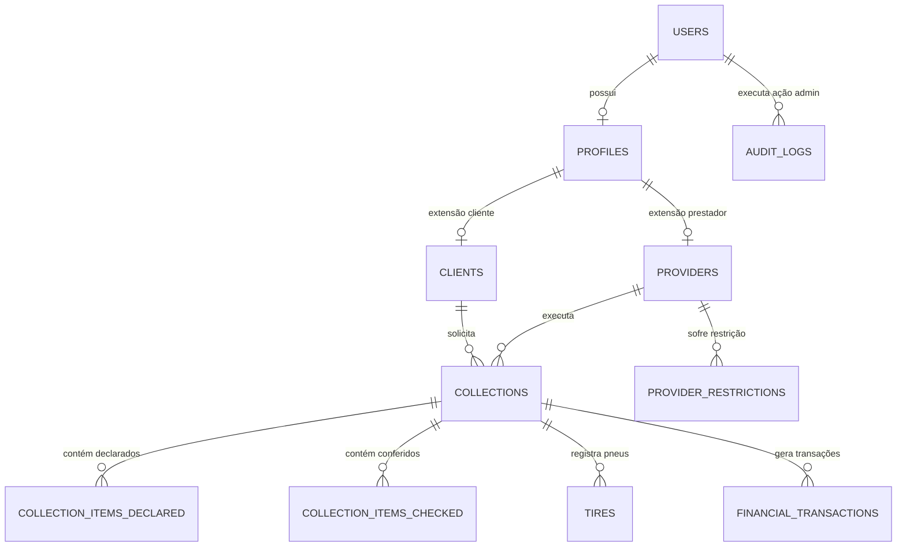

# 06 - Modelo de Dados (PostgreSQL)

## 1. Visão Geral do Banco de Dados

O banco de dados relacional PostgreSQL 15+ é responsável pela persistência transacional de todas as entidades do sistema. O modelo utiliza chaves primárias do tipo `UUIDv4` para garantir unicidade global e facilitar a geração offline de identificadores no cliente.

---

## 2. Diagrama Entidade-Relacionamento (ER)

---

## 3. Detalhamento das Tabelas Principais

### 3.1. `users` (Autenticação Base)
- `id` (UUID, PK): Identificador único do usuário.
- `email` (VARCHAR(255), UNIQUE, NOT NULL): E-mail de login.
- `password_hash` (VARCHAR(255), NOT NULL): Hash seguro da senha (Argon2id/bcrypt).
- `role` (VARCHAR(50), NOT NULL): Role do usuário (`CLIENTE`, `PRESTADOR`, `ADMINISTRADOR`).
- `status` (VARCHAR(50), NOT NULL): Status da conta (`ATIVO`, `SUSPENSO`, `INATIVO`).
- `created_at` (TIMESTAMPTZ, DEFAULT NOW()): Data de criação.
- `updated_at` (TIMESTAMPTZ, DEFAULT NOW()): Data de atualização.

### 3.2. `profiles` (Dados Pessoais e Comerciais)
- `id` (UUID, PK)
- `user_id` (UUID, FK -> users.id, UNIQUE, NOT NULL)
- `nome_razao_social` (VARCHAR(255), NOT NULL)
- `cpf_cnpj` (VARCHAR(20), UNIQUE, NOT NULL)
- `telefone` (VARCHAR(20), NOT NULL)
- `chave_pix` (VARCHAR(255), NULLABLE): Chave Pix para recebimento do prestador.
- `created_at` (TIMESTAMPTZ)

### 3.3. `providers` (Dados Específicos do Prestador)
- `id` (UUID, PK)
- `profile_id` (UUID, FK -> profiles.id, UNIQUE, NOT NULL)
- `reputacao_score` (NUMERIC(5,2), DEFAULT 5.00): Pontuação acumulada.
- `taxa_resposta` (NUMERIC(5,2), DEFAULT 100.00): Percentual de aceites.
- `status_operacional` (VARCHAR(50), DEFAULT 'DISPONIVEL'): (`DISPONIVEL`, `EM_COLETA`, `RESTITO`).
- `dados_veiculo_json` (JSONB): Informações de placa, modelo e capacidade.

### 3.4. `collections` (Coletas)
- `id` (UUID, PK)
- `codigo_identificador` (VARCHAR(20), UNIQUE, NOT NULL): Código legível por humanos (ex: `COL-2026-00891`).
- `client_id` (UUID, FK -> clients.id, NOT NULL)
- `provider_id` (UUID, FK -> providers.id, NULLABLE)
- `status` (VARCHAR(50), NOT NULL): Estado atual (`SOLICITADA`, `ACEITA`, `EM_CONFERENCIA`, `FINALIZADA`, etc.).
- `endereco_origem_json` (JSONB, NOT NULL): Logradouro, número, bairro, cidade, UF, CEP, lat/long.
- `data_agendada` (TIMESTAMPTZ, NOT NULL)
- `data_finalizacao` (TIMESTAMPTZ, NULLABLE)
- `snapshot_valor_prestador` (NUMERIC(10,2), NULLABLE): Valor fixado para pagamento ao prestador.
- `snapshot_valor_cliente` (NUMERIC(10,2), NULLABLE): Valor fixado para cobrança do cliente.
- `idempotency_key` (UUID, UNIQUE, NULLABLE): Chave de idempotência para criação offline.
- `created_at` (TIMESTAMPTZ)

### 3.5. `collection_items_declared` (Carga Declarada pelo Cliente)
- `id` (UUID, PK)
- `collection_id` (UUID, FK -> collections.id, NOT NULL)
- `marca` (VARCHAR(100), NOT NULL)
- `dimensao` (VARCHAR(50), NOT NULL)
- `quantidade_declarada` (INTEGER, NOT NULL)
- `observacao` (TEXT, NULLABLE)

### 3.6. `collection_items_checked` (Carga Conferida e Coletada pelo Prestador)
- `id` (UUID, PK)
- `collection_id` (UUID, FK -> collections.id, NOT NULL)
- `quantidade_conferida` (INTEGER, NOT NULL): Quantidade contada presencialmente.
- `quantidade_coletada` (INTEGER, NOT NULL): Quantidade efetivamente embarcada.
- `justificativa_divergencia` (TEXT, NULLABLE): Obrigatória se declarada != coletada.
- `fotos_divergencia_json` (JSONB, NULLABLE): URLs das evidências visuais.

### 3.7. `tires` (Registro Detalhado de Pneus Coletados)
- `id` (UUID, PK)
- `collection_id` (UUID, FK -> collections.id, NOT NULL)
- `dot` (VARCHAR(10), NOT NULL): Código DOT (ex: `2421`). **Permite repetição**.
- `semana_fabricacao` (INTEGER, NOT NULL): Extraído dos 2 primeiros dígitos do DOT.
- `ano_fabricacao` (INTEGER, NOT NULL): Extraído dos 2 últimos dígitos do DOT.
- `idade_calculada_anos` (INTEGER, NOT NULL): `Ano_Atual - ano_fabricacao`.
- `alerta_idade_obsoleto` (BOOLEAN, DEFAULT FALSE): TRUE se idade $\ge 7$ anos (ou limite configurado).
- `numero_fogo` (VARCHAR(50), NULLABLE): Identificador opcional.
- `numero_serie` (VARCHAR(50), NULLABLE): Identificador opcional.
- `estado_conservacao` (VARCHAR(50), NULLABLE)
- `created_at` (TIMESTAMPTZ)

### 3.8. `financial_transactions` (Lançamentos Financeiros Imutáveis)
- `id` (UUID, PK)
- `collection_id` (UUID, FK -> collections.id, NOT NULL)
- `tipo_entidade` (VARCHAR(20), NOT NULL): `CLIENTE` ou `PRESTADOR`.
- `perfil_id` (UUID, FK -> profiles.id, NOT NULL)
- `valor_total` (NUMERIC(10,2), NOT NULL)
- `status_pagamento` (VARCHAR(50), NOT NULL): `PENDENTE`, `PAGO`, `CANCELADO`.
- `data_vencimento` (DATE, NOT NULL)
- `data_pagamento` (TIMESTAMPTZ, NULLABLE)
- `created_at` (TIMESTAMPTZ)

### 3.9. `price_rules` (Tabela Paramétrica de Preços)
- `id` (UUID, PK)
- `perfil_alvo` (VARCHAR(20), NOT NULL): `CLIENTE` ou `PRESTADOR`.
- `faixa_inicio_quantidade` (INTEGER, NOT NULL)
- `faixa_fim_quantidade` (INTEGER, NOT NULL)
- `valor_unitario` (NUMERIC(10,2), NOT NULL)
- `vigencia_inicio` (DATE, NOT NULL)
- `vigencia_fim` (DATE, NULLABLE)
- `ativo` (BOOLEAN, DEFAULT TRUE)
- `criado_por_admin_id` (UUID, FK -> users.id, NOT NULL)

### 3.10. `provider_restrictions` (Histórico de Restrições de Prestadores)
- `id` (UUID, PK)
- `provider_id` (UUID, FK -> providers.id, NOT NULL)
- `admin_responsavel_id` (UUID, FK -> users.id, NOT NULL)
- `motivo` (TEXT, NOT NULL)
- `evidencias_json` (JSONB, NOT NULL): Links de fotos/documentos.
- `data_inicio` (TIMESTAMPTZ, NOT NULL)
- `prazo_fim` (TIMESTAMPTZ, NULLABLE): NULL indica indeterminado até revisão.
- `status` (VARCHAR(50), NOT NULL): `ATIVA`, `REVOGADA`, `EXPIRADA`.
- `created_at` (TIMESTAMPTZ)

### 3.11. `audit_logs` (Trilha de Auditoria do Sistema)
- `id` (UUID, PK)
- `user_id` (UUID, FK -> users.id, NOT NULL)
- `acao` (VARCHAR(100), NOT NULL)
- `entidade_afetada` (VARCHAR(100), NOT NULL)
- `entidade_id` (UUID, NULLABLE)
- `valor_anterior_json` (JSONB, NULLABLE)
- `valor_novo_json` (JSONB, NULLABLE)
- `ip_origem` (VARCHAR(45), NOT NULL)
- `created_at` (TIMESTAMPTZ, DEFAULT NOW())

---

## 4. Decisões Pendentes sobre o Modelo de Dados

- `DECISÃO PENDENTE`: Criação de tabela específica para frotas de veículos cadastradas por prestadores PJ com múltiplos motoristas.
